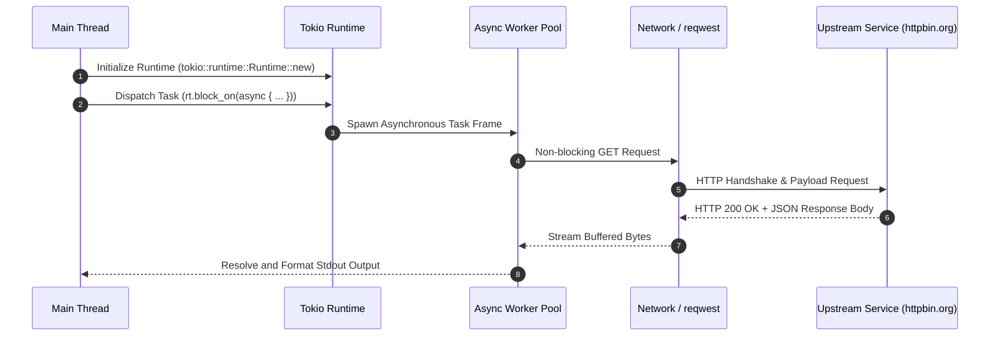
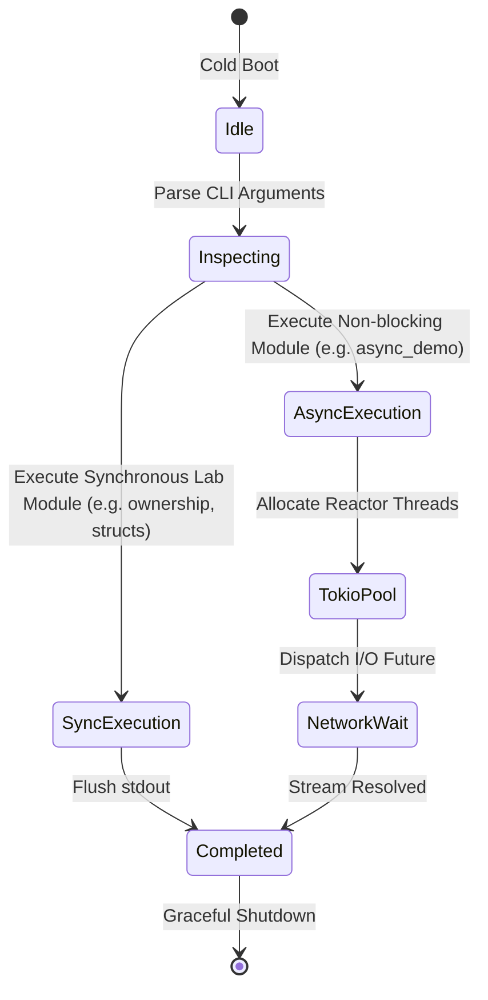

<div align="center">

# YouRust Lab

**A High-Performance Rust Experimental Workbench & Modular Systems Laboratory**

[](https://www.rust-lang.org/)
[](https://tokio.rs/)
[](https://docs.rs/reqwest)
[](https://crates.io/)
[](LICENSE)

<br/>

<p align="center">
  
</p>

</div>

---

## Overview

**YouRust Lab** is an exploratory, modular systems programming laboratory engineered to investigate, benchmark, and demonstrate idiomatic Rust primitives. The repository encapsulates everything from zero-cost abstractions, borrow-checker memory mechanics, and trait polymorphism to high-throughput asynchronous networking with Tokio and Reqwest.

Designed as both a robust developer testbed and a scalable foundation for modern systems engineering, each module isolates specific language guarantees and concurrency models.

---

## Architecture & Module Flow

The laboratory organizes systems concepts into discrete operational domains. The diagram below illustrates the module hierarchy and dispatch structure:

```mermaid
graph TD
    subgraph "Core Orchestration"
        Entry["Entrypoint: src/main.rs"]
        Dispatch["Module Dispatcher / Runner"]
    end

    subgraph "Foundation & Type System"
        Variables["src/variables.rs: Mutability & Primitives"]
        Functions["src/functions.rs: Execution Frames"]
        ControlFlow["src/control_flow.rs: Iterators & Branching"]
        Generics["src/generics.rs: Monomorphization"]
    end

    subgraph "Memory & Resource Management"
        Ownership["src/ownership.rs: Move Semantics & Affine Types"]
        Structs["src/structs.rs: Memory Layout & Methods"]
        Enums["src/enums.rs: Algebraic Data Types"]
        Traits["src/traits.rs: Dynamic & Static Dispatch"]
        Collections["src/collections.rs: Heap Allocations"]
    end

    subgraph "Resilience & Concurrency"
        ErrorHandling["src/error_handling.rs: Result<T, E> & Recovery"]
        Modules["src/modules.rs: Visibility & Namespaces"]
        AsyncRuntime["src/async_demo.rs: Tokio Worker Pool & HTTP Client"]
    end

    Entry --> Dispatch
    Dispatch --> Variables
    Dispatch --> Ownership
    Dispatch --> ErrorHandling
    Dispatch --> AsyncRuntime
```



### Asynchronous Execution Cycle



---

## Technical Specifications & Reference

<details>
<summary><strong>1. Installation & Prerequisites</strong></summary>

### Prerequisites
- **Rust Toolchain**: 1.85.0+ (supports Rust Edition 2024)
- **Cargo**: Bundled with official Rust distribution
- **C Compiler**: MSVC (Windows), GCC/Clang (Linux/macOS)

### Getting Started

Clone the repository and verify the toolchain:

```bash
git clone https://github.com/AlphaIsYour/yourust-lab.git
cd yourust-lab
rustup update stable
cargo check
```

Execute the current entrypoint:

```bash
cargo run
```

To compile optimized release binaries:

```bash
cargo build --release
```
</details>

<details>
<summary><strong>2. Environment Configuration</strong></summary>

The project supports optional environment configuration variables for asynchronous networking and runtime profiling:

```env
# Runtime Logging Level (error, warn, info, debug, trace)
RUST_LOG=info
RUST_BACKTRACE=1

# Networking & Telemetry Defaults
HTTP_TIMEOUT_SECS=10
HTTP_TARGET_URL=https://httpbin.org/get
HTTP_USER_AGENT=YouRustLab/0.1.0
CONCURRENCY_WORKERS=4
```
</details>

<details>
<summary><strong>3. Project Directory Structure</strong></summary>

```text
yourust-lab/
├── .cargo/                 # Cargo configuration profiles (optional)
├── src/
│   ├── main.rs             # Application entrypoint & dispatch runner
│   ├── basic.rs            # Terminal stdout fundamentals
│   ├── variables.rs        # Mutability, constants, and stack allocation
│   ├── functions.rs        # Function signatures and return types
│   ├── control_flow.rs     # Branching, match expressions, and loops
│   ├── ownership.rs        # Move semantics, cloning, and ownership passing
│   ├── structs.rs          # Composite data structures and methods
│   ├── enums.rs            # Enumerations and pattern matching
│   ├── traits.rs           # Interface abstraction and polymorphism
│   ├── generics.rs         # Generic constraints and monomorphization
│   ├── collections.rs      # Vector and HashMap dynamic allocations
│   ├── error_handling.rs   # Result<T, E> idioms and panic safety
│   ├── modules.rs          # Scoping and sub-module isolation
│   └── async_demo.rs       # Tokio runtime and asynchronous reqwest client
├── Cargo.lock              # Deterministic dependency lockfile
├── Cargo.toml              # Package manifest and crate metadata
├── ROADMAP_ISSUES.md       # Production roadmap and backlog tracking
└── README.md               # Repository documentation and architecture overview
```
</details>

<details>
<summary><strong>4. State Machine & Execution Modes</strong></summary>

The laboratory transitions across distinct execution states during lifecycle operations:


</details>

<details>
<summary><strong>5. Security & Safety Checklist</strong></summary>

- [x] **Memory Safety**: Guaranteed by Rust ownership and borrow-checker invariants; zero `unsafe` blocks used in user code.
- [x] **Async Deadlock Prevention**: Synchronous operations avoided inside Tokio worker loops.
- [ ] **Dependency Audit**: Automated audit configured via `cargo audit` to monitor known crate vulnerabilities.
- [ ] **Error Propagation**: Gradual migration from `.unwrap()` to structured error propagation (`anyhow` / `thiserror`).
- [ ] **Input Sanitization**: Boundary checks on dynamic CLI inputs and HTTP request parameters.
</details>

---

## Roadmap & Issue Tracking

Refer to [ROADMAP_ISSUES.md](file:///c:/laragon/www/yourust-lab/ROADMAP_ISSUES.md) for the structured backlog of enterprise enhancements, including CLI argument parsing with `clap`, interactive TUI dashboards, centralized error handling, and automated GitHub Actions CI/CD workflows.

---

## License

This project is open-source and available under the [MIT License](LICENSE).
